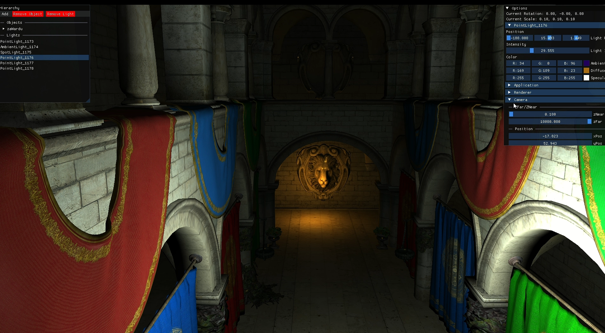

# FireEngine v2  
**FireEngine v2** is C++ rendering engine that builds upon things i learned while making Fire-Engine v1, now featuring a full **Core Profile OpenGL** backend.
it's my personal journey into computer graphics, rendering and engine architecture!


---

## Features

- **Modern OpenGL Renderer:** Built with Core Profile OpenGL, offering a programmable pipeline for full rendering control.
- **Assimp Integration:** Supports loading of 3D models in multiple formats, including **OBJ, FBX, GLTF, PLY**, and more.
- **Physically-Based Rendering (PBR):** Realistic shading and material system using metal/roughness workflow.
- **Multiple Light Types:** Directional, point, and spot lights with attenuation and shadow mapping support is underway!.
- **Post-Processing Pipeline:** Includes bloom, tone mapping, gamma correction, and custom shader passes.
- **ImGui Debug Tools:** Real-time tweaking and debugging with a imGUI UI overlay.
- **Camera System:** Fly-through camera with view frustum culling and projection matrices.
- **Wireframe & Normal Debug Views:** Easily visualize mesh topology and surface normals.
- **Material System:** Supports loading of complex materials with textures like albedo, normal, roughness, metallic, and AO.
- **Framebuffer Management:** Modular render passes for forward and deferred rendering (WIP).

---

## Installation

### Prerequisites

- Modern C++ compiler (C++17+)
- OpenGL 3.3+ capable GPU
- CMake 3.10+
- Assimp
- GLFW
- GLAD
- glm
- stb_image
- ImGui

### Dependencies

- **GLFW** for windowing and context creation.  
- **GLAD** for OpenGL function loading.  
- **Assimp** for 3D model importing.  
- **ImGui** for runtime UI/debug overlay.  
- **glm** : for math and linear algebra

---

### Building

1. Clone the repository:
   ```bash
   git clone https://github.com/Eual11/FireEngine-V2
   ```

2. Set up and build with CMake:
   ```bash
   cd FireEngine-v2
   mkdir build && cd build
   cmake ..
   cmake --build . --config Release 
    ```

3. Run the engine:
   ```bash
   cd Release
   ./FireEngine
   ```

---

## Controls

Camera movement:
- `W`, `A`, `S`, `D` – Move camera
- `Space`, `Left Shift` – Move up/down
- Mouse – Look around
- `Esc` – Close Window

ImGui provides runtime controls for lighting, materials, and effects.

---

## Screenshots


  
*GLTF model imported with Assimp.*


  
*Light Properties UI.*


  
*A scene rendered with PBR pipeline and multiple light sources.*

  
*Post-processing effects bloom and tonemapping in action.*


  
*Rendering Sponza Atrium*


---

## Video Showcase

<a href="https://youtube.com/watch?v=0sYWNkoNxeI">
    
</a>


---

## Contributing

Pull requests are welcome! Whether it's fixing a bug, improving documentation, or suggesting features—every bit helps.

---


